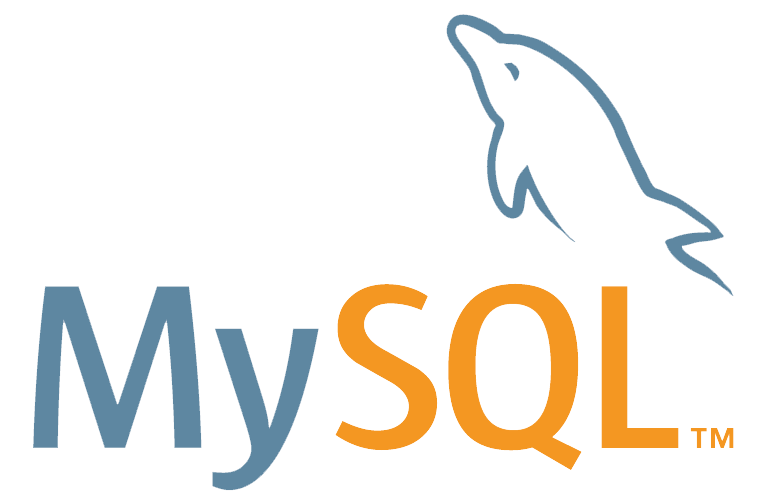

# Swiftagram

### Stack used (LEMP):-

**Linux**


**Nginx**


**MySQL/SQLite**


**PHP**


 <br>


Welcome to Swiftagram...

I am so glad you are here!


Swiftagram is my "curated" version of the popular social media, Instagram.

I built Swiftgram from the ground up using PHP, with Laravel as the framework and Composer as my package manager.

Swiftagram is visually appealing and was functionally made to follow as close to the original, Instagram, as possible.

Features of Swiftagram:

Swiftagram incorporates fully functional login and register forms which error out if the requirements are not met - such as the password.

Swiftagram also features scaling databases that host a wide range of user input information and is the forefront of the entire application.

Using Swiftagram, all profiles can: update their profile picture, edit their profile bio such as their personal
descriptor or title and to wrap up and finalise, add a designated caption or URL for added customisation.

Following on from above, after setting up your profile you can then take the reins and start posting pictures for all to see!

Once you have explored around and posted, you can go back to the home screen where things will be looking a lot more crowded!
Posts will be listed, ordered by date and time. You can also visit the post and the profile to keep the contact going - who knows
where it will lead! 

When you have finished with your session, you can proceed to log out. Your journey will continue exactly where you left off while you conquer
the real, big world out there!

I sincerely thank you for your interest in me and hope you have enjoyed this mini-presentation!
Arman


## Getting Started

These instructions will get you a copy of the project up and running on your local machine for development and testing purposes. See deployment for notes on how to deploy the project on a live system.

### Installing

A step by step series of examples that tell you how to get a development environment running

**1 - Clone GitHub repo for this project locally**

If the project is hosted on github, we can use git on your local computer to clone it from github onto your local computer.

Note: Make sure you have git installed locally on your computer first.

```
git clone linktogithubrepo.com/ projectName
```

**2 - 'cd' into your project**

```
cd YOURPROJECTNAME
```

**3 - Install Composer Dependencies**

Whenever you clone a new Laravel project you must now install all of the project dependencies. 
This is what actually installs Laravel itself, among other necessary packages to get started.

```
composer install
```

**4 - Install NPM Dependencies**
<br>
Just like how we must install composer packages to move forward, we must also install necessary NPM packages to move forward. 
This will install Vue.js, Bootstrap.css, Lodash, and Laravel Mix.
```
npm install
```

**5 - Create a copy of your .env file**
<br>
.env files are not generally committed to source control for security reasons. But there is a .env.example which is a template of the .env file that the project expects us to have. 
So we will make a copy of the .env.example file and create a .env file that we can start to fill out to do things like database configuration in the next few steps.

```
cp .env.example .env
```

This will create a copy of the .env.example file in your project and name the copy simply .env.


**6 - Generate an app encryption key**

Laravel requires you to have an app encryption key which is generally randomly generated and stored in your .env file.
The app will use this encryption key to encode various elements of your application from cookies to password hashes and more.

Laravel’s command line tools thankfully make it super easy to generate this. 
In the terminal we can run this command to generate that key. (Make sure that you have already installed Laravel via composer and created an .env file before doing this, of which we have done both).
```
php artisan key:generate
```


**7 - Create an empty database for our application**
<br>
Create an empty database for your project using the database tools you prefer. 
Just create an empty database here, the exact steps will depend on your system setup.


**8 - In the .env file, add database information to allow Laravel to connect to the database**

We will want to allow Laravel to connect to the database that you just created in the previous step. 
To do this, we must add the connection credentials in the .env file and Laravel will handle the connection from there.

In the .env file fill in the DB_HOST, DB_PORT, DB_DATABASE, DB_USERNAME, and DB_PASSWORD options to match the credentials of the database you just created. 
This will allow us to run migrations and seed the database in the next step.


**9 - Migrate the database**

Once your credentials are in the .env file, now you can migrate your database.
```
php artisan migrate
```
It’s not a bad idea to check your database to make sure everything migrated the way you expected.


#### Demo


##### Sources

Installation instructions kindly provided by https://devmarketer.io/learn/setup-laravel-project-cloned-github-com/ - Please visit for full guidelines!

Swiftagram was built by me, created by Victor as part of the Laravel PHP Framework Project, hosted by FreeCodeCamp.


